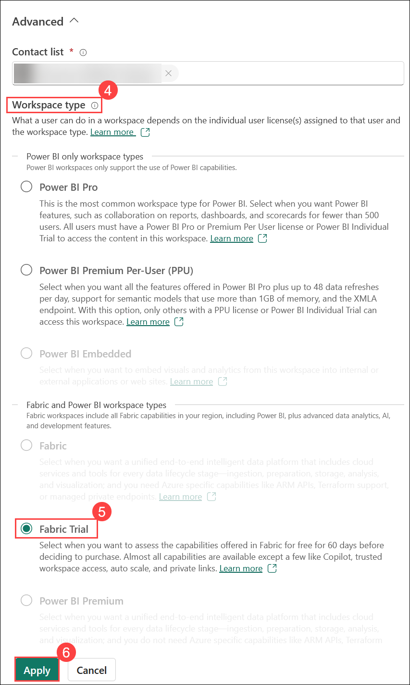
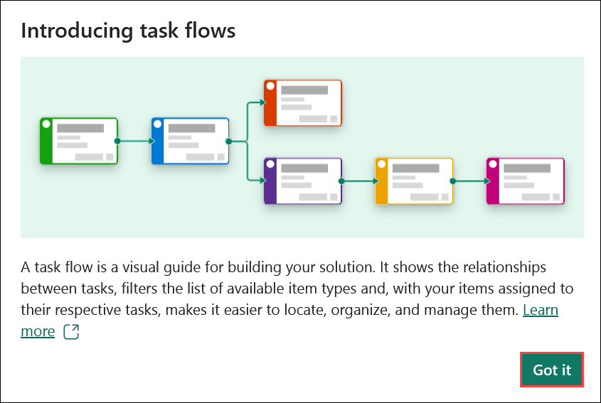
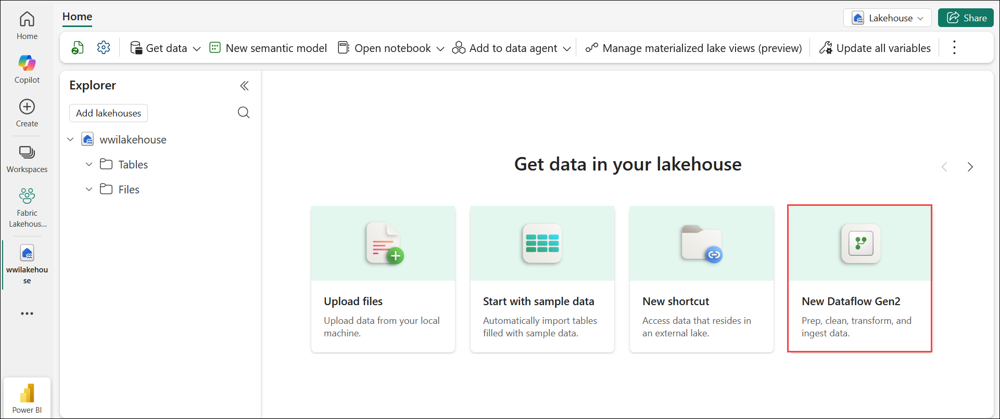
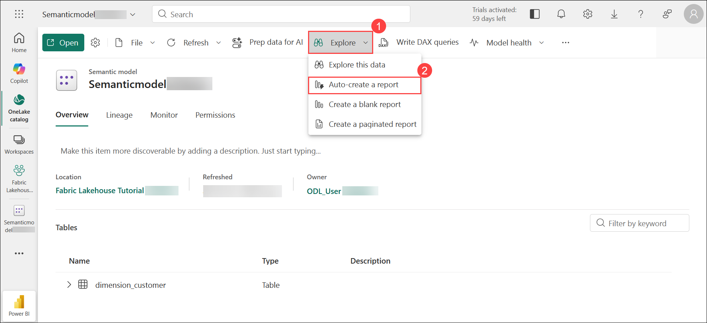

# Exercise 1: Build a workspace and Lakehouse

### Estimated Duration: 150 Minutes

## Overview

In this exercise, you'll go through the end-to-end process of building a modern data platform using Microsoft Fabric. The goal is to create a centralized lakehouse that combines storage, data ingestion, analytics, and reporting, demonstrating how different Fabric components work together.

You’ll start by activating SharePoint Online to enable required cloud services. Then, you’ll set up a dedicated workspace in Microsoft Fabric and create a lakehouse to store and manage structured and unstructured data. You'll ingest sample data into the lakehouse using Dataflow Gen2 and prepare it in Delta table format. Once the data is ready, you’ll switch to Power BI to build a report that visualizes the insights. You’ll configure the semantic model, explore the dataset, and auto-generate a report, all from within the same workspace.

By the end of this lab, you’ll have a full understanding of how to use Microsoft Fabric to build scalable data workflows that include data engineering, transformation, and reporting, all in one integrated environment.

## Lab objectives

- Task 1: Activate SharePoint Online
- Task 2: Create a Workspace
- Task 3: Create a lakehouse
- Task 4: Ingest sample data
- Task 5: Build a report

## Task 1: Activate SharePoint Online

In this task, you will activate SharePoint Online by signing into the Office homepage.

1. To activate SharePoint Online, copy the **Office homepage link** and open this link inside the VM in a new tab.

   ```
   https://office.com
   ```

   >**Note:** If it asks you to sign in, enter the required credentials from **Environment** tab and sign in to the Office portal.

      

1. If **All your work in one place, now easier with AI.** pop-up appears close it by clicking on **X**.

   

1. You have now successfully signed into **Office homepage** and activated **SharePoint Online**.

   

   >**Note:** This will be required for Task 4 in the lab.

1. You can now close this tab and proceed to the next task.

## Task 2: Create a workspace

In this task, you will create a Fabric workspace. The workspace contains all the items needed for this lakehouse tutorial, which includes lakehouse, dataflows, Data Factory pipelines, notebooks, Power BI datasets, and reports.

1. Navigate to **Workspaces (1)** from the left pane, and click on **+ New workspace (2)** to create a new workspace.

    

2. Fill out the **Create a workspace** form with the following details:

   - **Name:** Enter **Fabric Lakehouse Tutorial** **<inject key="DeploymentID" enableCopy="false" />** **(1)** .

   - **Description:** Enter **Lakehouse Demo (2)**

   - Click on **Advanced  (3)**

      

4. Under **Workspace type (4)**, select **Fabric Trial (5)** and click on **Apply (6)** to create and open the workspace.

   

    > **Note:** If **Introducing task flows** notification appears, click **Got it** to proceed. 

      

5. A new workspace titled **Fabric Lakehouse Tutorial** **<inject key="DeploymentID" enableCopy="false" />** will be created. This workspace will serve as a designated area where you can organize and manage your project components, data, and reports, providing a centralized hub for all related activities and resources.

   > **Congratulations** on completing the task! Now, it's time to validate it. Here are the steps:
   > - If you receive a success message, you can proceed to the next task.
   > - If not, carefully read the error message and retry the step, following the instructions in the lab guide. 
   > - If you need any assistance, please contact us at cloudlabs-support@spektrasystems.com. We are available 24/7 to help you out.
 
   <validation step="e075f8d4-19b3-4992-9f58-df7a6b94d338" />

## Task 3: Create a lakehouse

In this task, you will create a lakehouse within Microsoft Fabric to manage and analyze data.

1. From the newly created **Fabric Lakehouse Tutorial <inject key="DeploymentID" enableCopy="false"/>** Power BI workspace, click on **+ New item (1)**, in the search bar, type **Lakehouse (2)**, and from the results, select **Lakehouse (3)** to proceed.

   

1. In the New Lakehouse dialog box, enter **wwilakehouse (1)** in the Name field, then **unselect (2)** Lakehouse schemas and click **Create (3)**.

   

   > **Congratulations** on completing the task! Now, it's time to validate it. Here are the steps:
   > - If you receive a success message, you can proceed to the next task.
   > - If not, carefully read the error message and retry the step, following the instructions in the lab guide. 
   > - If you need any assistance, please contact us at cloudlabs-support@spektrasystems.com. We are available 24/7 to help you out.
 
   <validation step="98c90546-5680-4978-b3ae-eb32a2422fdc" />

## Task 4: Ingest sample data

In this task, you will load sample data into the lakehouse for processing and analysis.

1. In the Lakehouse Explorer, from the options to **Get data in your lakehouse** select **New Dataflow Gen2**.

   

1. In the **New Dataflow Gen2** dialogue box, provide the name as **Dataflow 1 (1)**, **Uncheck (2)** the **Enable Git integration, deployment pipelines and Public API scenarios**, and click on **Create (3)** to proceed.

   

3. On the new dataflow pane, select **Import from a Text/CSV file**.

   

4. On the **Connect to data source (1)** pane, select the **Upload file (2)** radio button, and then click on **Browse... (3)**.

   

5. In the Open window, navigate to the **C:\FabricFiles (1)** folder, select the **dimension_customer.csv (2)** file, and click on **Open (3)**.

     

6. After the file is **uploaded (1)**, click on **Next (2)**.

   

   >**Note:** The **Preview file data** page might require a few minutes to load.

7. From the **Preview file data** page, preview the data and click on **Create** to proceed and return to the dataflow canvas.
   
   .png)

8. It will open up a **Power Query** editor. In the **Query settings (1)** pane, verify whether **dimension_customer (2)** is reflected under the **Name** field. 

   

9. Next, remove the default **Data destination** by clicking the **X** icon next to the Lakehouse under the **Data destination** section.

   

10. A prompt will appear asking you to confirm the removal of the data destination. Click **OK** to proceed.

      .png)
   
11. In the **Query** editor, click on **Add data destination (1)**, and select **Lakehouse (2)**.

      

    >**Note:** If you are unable to find the Query option, click the drop-down arrow on the right side of the box.

      

12. In the **Connect to data destination** pane, confirm the **Connection**, and click on **Next**.

    .png)

13. In the **Choose destination target** pane, confirm the name of the table to be **dimension_customer (1)**. Now, expand your workspace, select **wwilakehouse (2)**, and click on **Next (3)**.

     

14. In the **Choose destination settings** window, leave the settings unchanged and select **Save settings** to return to the dataflow canvas.

    .png)

15. Select **Publish** from the bottom-right of the dataflow canvas to save your changes.

    .png)

16. A spinning circle next to the dataflow's name indicates publishing is in progress in the item view.

    .png)

17. Once publishing is complete, click on the **Ellipsis (...) (1)** and select **Properties (2)**.

    

18. Rename the dataflow to **Load Lakehouse Table (1)** and click on **Save (2)**.

    

19. Click **Refresh now** next to the dataflow name to execute it. This will load data from the source file into the lakehouse table.

    

20. Once the dataflow is refreshed, select **wwilakehouse** from the **Fabric workspace**.

    

21. Now, you can view the **dimension_customer** delta table. Select the table to preview its data.

    

    >**Note:** If you are unable to view _dimension_customer_ delta table, please refresh the page.

23. You can also use the SQL analytics endpoint of the lakehouse to query the data with SQL statements. From the Lakehouse **drop-down (1)** menu at the top right of the screen, select **SQL analytics endpoint (2)** 

      

24. From the Home tab, click on the **drop-down (1)** and select **New SQL query (2)** to write your SQL statements.

    

25. Enter the following SQL query to group and count rows by the BuyingGroup column in the **dimension_customer** table.

    ```
    SELECT BuyingGroup, Count(*) AS Total
    FROM dimension_customer
    GROUP BY BuyingGroup
    ```

26. Click on **Run (1)** to run the query and view the **Results (2)**.

    

## Task 5: Build a report

In this task, you will create a report using Power BI based on the ingested data.

1. Navigate to your workspace **Fabric Lakehouse Tutorial** **<inject key="DeploymentID" enableCopy="false" />** and select **wwilakehouse**

    

1.  From the **drop-down (1)** in the top right corner, switch to the **SQL analytics endpoint (2)** view.

    

1. Previously, all lakehouse tables and views were automatically included in the semantic model. With recent updates, for new lakehouses, you now need to manually add the required tables.

1. Click on **New semantic model**.

   

1. Enter the name as **Semanticmodel<inject key="DeploymentID" enableCopy="false" />** **(1)**, select **dbo (2)** , **dimension_customer (3)** and then click on **Confirm (4)**.

   

1. On to the left side click on the **workspace (1)**, select the newly created **Semanticmodel<inject key="DeploymentID" enableCopy="false" />** **(2)**.

   

1. In the dataset pane, you can view all available tables. You can choose to create a report from scratch, build a paginated report, or let Power BI generate one automatically. For this lab, click the **Explore (1)**, then select **Auto-create a report (2)**.

   

1. Since the table is a dimension and there are no measures in it, Power BI creates a measure for the row count, aggregates it across different columns, and creates different charts as shown in the following image. You can save this report for the future by selecting **Save** from the top ribbon.

    

1. Enter a name for your report as **Profit Reporting (1)** and click on **Save (2)**.

    

1. Your report will now be stored within the same Power BI workspace, ensuring that all your data and visualizations remain organized in one central location for easy access and management.

   > **Congratulations** on completing the task! Now, it's time to validate it. Here are the steps:
   > - If you receive a success message, you can proceed to the next task.
   > - If not, carefully read the error message and retry the step, following the instructions in the lab guide. 
   > - If you need any assistance, please contact us at cloudlabs-support@spektrasystems.com. We are available 24/7 to help you out.

 <validation step="3e9d2b60-3cb7-4f4a-a7b2-bb413ab08297" />

## Summary:

In this exercise, you have:

- Activated SharePoint Online, ensuring that required cloud-based collaboration and storage services are available for specific tasks in the lab.
- Created a dedicated workspace in Microsoft Fabric to organize and manage all related assets, including the lakehouse, dataflows, and reports.
- Created a lakehouse in Microsoft Fabric, which serves as a centralized repository for structured and unstructured data, enabling efficient data organization and processing.
- Ingested sample data into the lakehouse, preparing the environment for further analysis and enabling data exploration using a Delta table format.
- Built and saved a report using Power BI, showcasing insights through visualizations by leveraging the ingested data and lakehouse structure.
- Utilized the seamless integration of Microsoft Fabric's components to perform end-to-end data workflows, demonstrating how data engineering, analytics, and reporting work together in a single platform.

### You have successfully completed the exercise. Click on Next >> to proceed with the next exercise.


