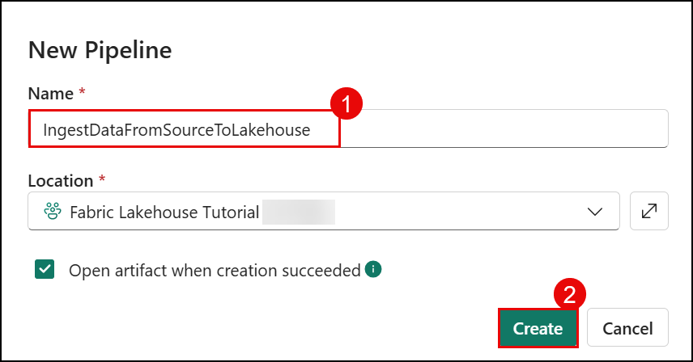

# Exercise 2: Ingest data into the Lakehouse

### Estimated Duration: 90 Minutes

## Overview

In this exercise, you will ingest sample data specifically, the Public Holidays table into the lakehouse. You'll configure a data pipeline within Microsoft Fabric to enable efficient data ingestion. The data will be validated and organized into a structured format, ensuring it is ready for further analysis and reporting. This exercise demonstrates the platform's ability to handle complex data processes efficiently, preparing data for advanced analytics and insights.

## Lab objective

- Task 1: Ingest data

## Task 1: Ingest data

In this task, you will import sample data, specifically the Public Holidays table, into the lakehouse by setting up a data pipeline.

1. Navigate to the **Fabric Lakehouse Tutorial** **<inject key="DeploymentID" enableCopy="false" />** Workspace, click on the **+ New item (1)** button and search for the **Pipeline (2)** in the search bar and select **Pipeline (3)** from the Get data blade.

   

2. In the **New pipeline** dialog box, specify the name as **IngestDataFromSourceToLakehouse (1)** and click on **Create (2)**.

   

3. On the **Build a pipeline to organize and move your data** pop-up, select **Pipeline activity (1)**, then choose **Copy Data (2)**.

   

4. On the Pipeline page, click on **Source (1)**. From the **Connection** dropdown select **Browse all (2)**.

   

5. From the **Choose data source** pane, select **Sample data (1)**, then click on the **Public Holidays (2)**.

   

5. In the **Connect to data source** pane, preview the **Public Holidays** dataset, and select **OK** to proceed. 

   

6. Now you will see that **Source** connection is set to **Public Holidays** dataset.

   

   > **Note:** You can click on the **Preview Data** to see if the data is loading or not.

      

1. Navigate to **Destination (1)** and from the **Connection** dropdown select **Browse all (2)**.

   

6. In the **Choose data destination** pane, search for **Lakehouse (1)** and select **wwilakehouse (2)**.

   

7. Once the Data Destination **Connection (1)** is selected with the existing lakehouse, select **Files (2)** from the **Root folder**. Ensure it is has **Paraquet (3)** file format. 

   

8. Once **Source & Destination** are set, then leave everything default and click on **Run** to proceed.

    

9. Click **Save and Run**. You can schedule pipelines to refresh data periodically. In this tutorial, we only run the pipeline once.

   

10. You can monitor the pipeline execution and activity in the **Output** tab.

      

11. Now, navigate back to **Fabric Lakehouse Tutorial** **<inject key="DeploymentID" enableCopy="false" />** workspace and select **wwilakehouse** to launch **Lakehouse explorer**.

    

12. Confirm that a new file has been created in the Lakehouse Explorer view, and that it contains the copied data.

    

      >**Note:** Click Refresh from the toolbar in the Home tab. 

      

   > **Congratulations** on completing the task! Now, it's time to validate it. Here are the steps:
   > - If you receive a success message, you can proceed to the next task.
   > - If not, carefully read the error message and retry the step, following the instructions in the lab guide. 
   > - If you need any assistance, please contact us at cloudlabs-support@spektrasystems.com. We are available 24/7 to help you out.
 
   <validation step="97e3f082-96e0-4665-bdab-1a69221a56d9" />

## Summary:
In this exercise, you have:

- Created a data pipeline in the Fabric workspace to automate data ingestion.
- Imported the Public Holidays dataset from the sample data source into the lakehouse.
- Verified the imported data and ensured it's structured for downstream analysis.

### You have successfully completed the Hands-on lab.

In this lab **Get data into Fabric Lakehouse**, you have demonstrated proficiency in leveraging Microsoft Fabric for end-to-end data workflows. Beginning with the creation of a Fabric workspace, you activated a 60-day trial to explore the platform's capabilities. You proceeded to build a lakehouse, effectively managing both structured and unstructured data, and utilized Power BI to create insightful visualizations. Additionally, you designed and executed a data pipeline to ingest and organize sample data (Public Holidays) into the lakehouse. This demonstrated how data engineering, analytics, and reporting come together within Microsoft Fabric. The hands-on experience gave you practical skills to manage and analyze data in a unified environment—preparing you to handle real-world data workflows and deliver meaningful insights.
