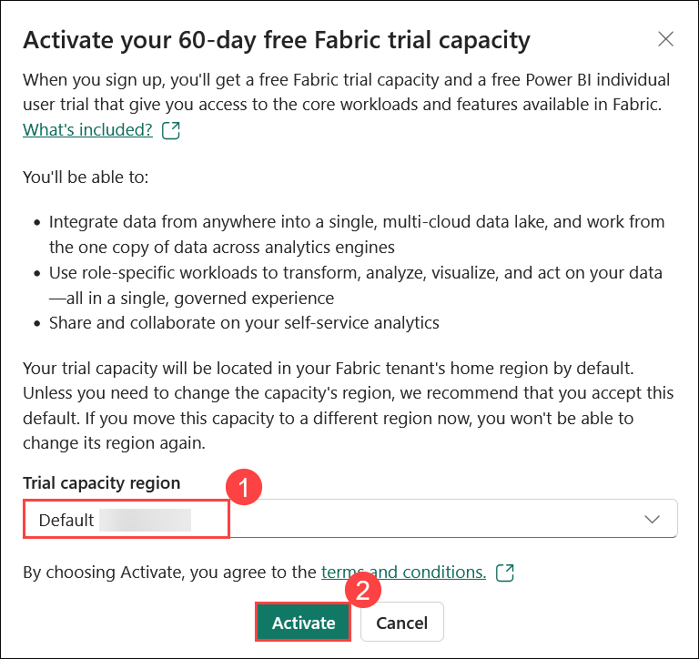

# Get data into Fabric Lakehouse

### Overall Estimated Duration: 4 Hours

## Overview

In this hands-on lab, you will work through a comprehensive data processing and analytics flow. You'll begin by setting up the data source, which consists of Parquet files stored in an unpartitioned structure, with each table organized into its folder. You will create a pipeline to ingest this historical or one-time data into a Lakehouse. Next, you'll create a Lakehouse, ingest the data into its files section, and then establish Delta Lake tables in the Tables section for structured storage.  

You will utilize **Microsoft Fabric**, a unified data analytics platform that integrates seamlessly with various tools and services for end-to-end data processing. Using **Microsoft Fabric Workspace**, you will organize and manage your data assets efficiently. The **Lakehouse** in Microsoft Fabric serves as the central data repository, combining the scalability of a data lake with the structure and performance of a data warehouse. This enables you to perform analytics and reporting tasks effectively while ensuring a structured and organized data flow.

## Objectives

Understand how to set up a Fabric workspace, build a lakehouse, ingest and transform data, and create reports. By the end of this lab, you will be able to:

- **Create a Fabric workspace:** Gain experience in creating and setting up a Fabric workspace, including understanding prerequisites and executing the workspace creation process.
- **Build a lakehouse:** Gain experience in building a lakehouse by activating SharePoint Online, creating the lakehouse, ingesting sample data, and building a report.
- **Ingest data into the lakehouse:** Learn to ingest data into the lakehouse, focusing on efficient and effective data integration methods. 

## Pre-requisites

To effectively perform these exercises, you need basic knowledge of Microsoft Azure, Microsoft Fabric, SharePoint Online, and data management principles. You also need to be familiar with creating and managing lakehouses, data ingestion, transformation, and reporting in Microsoft Fabric or Power BI.

## Architecture

In this hands-on lab, you will work through the architecture flow illustrated in the diagram, focusing on data ingestion, transformation, storage, and consumption. You’ll start by connecting to various data sources, both structured and unstructured, and utilizing shortcuts or data pipelines to ingest this data into a Lakehouse. Once the data is ingested, you’ll transform it using notebooks and dataflows, ensuring it is optimized for analysis. The transformed data will be stored in the Lakehouse, a hybrid storage solution that supports both raw and structured data. Finally, you will connect to this data using tools like Power BI or SQL endpoints, enabling real-time reporting and visualization. Throughout the lab, you'll gain hands-on experience in managing and analyzing data end-to-end within this integrated architecture.

## Architecture Diagram


## Explanation of Components

- **Microsoft Fabric:** Microsoft Fabric is a comprehensive analytics and data platform tailored for enterprises seeking an integrated solution. It covers all aspects of data management, including movement, processing, ingestion, transformation, real-time event routing, and reporting. The platform provides a full range of services, such as Data Engineering, Data Factory, Data Science, Real-Time Analytics, Data Warehousing, and Databases.

- **SharePoint Online:** SharePoint Online is a cloud-based service from Microsoft that facilitates collaboration, document management, and content sharing within organizations. It enables users to create, store, and manage web-based documents and data, offering tools for team sites, document libraries, and lists.

- **Fabric Lakehouse:** Microsoft Fabric Lakehouse is a data architecture platform designed to store, manage, and analyze both structured and unstructured data in one unified location. It offers flexibility and scalability, enabling organizations to handle extensive data volumes through a range of tools and frameworks for processing and analysis. The platform integrates seamlessly with other data management and analytics tools, delivering a comprehensive solution for data engineering and analytics.

- **Power BI:** Power BI is a suite of software services, applications, and connectors that collaborate to transform disparate data sources into cohesive, visually engaging, and interactive insights. Whether your data comes from an Excel spreadsheet or a mix of cloud-based and on-premises data warehouses, Power BI enables you to seamlessly connect to these sources, uncover and visualize key information, and share insights with anyone you choose.

- **SQL:** SQL(Structured Query Language) is a standardized programming language used to manage and manipulate relational databases. It allows users to perform operations such as querying data, inserting, updating, and deleting records, as well as defining and altering database structures. SQL is essential for efficiently handling and analyzing structured data within relational databases.

**Fabric trial provides access to most features, but excludes Copilot, private links, and trusted workspace access ([learn more](https://learn.microsoft.com/en-us/fabric/fundamentals/fabric-trial#overview-of-the-trial-capacity)).**


## Getting Started with the Lab
 
Once the environment is provisioned, a virtual machine (LabVM) and lab guide will be loaded in your browser. Use this virtual machine throughout the workshop to perform the lab. You can see the number on the bottom of the Lab guide to switch to different exercises in the lab guide.
 
## Accessing Your Lab Environment
 
Once you're ready to dive in, your virtual machine and **Guide** will be right at your fingertips within your web browser.
 
   

## Virtual Machine & Lab Guide
 
Your virtual machine is your workhorse throughout the workshop. The lab guide is your roadmap to success.
 
## Exploring Your Lab Resources
 
To get a better understanding of your lab resources and credentials, navigate to the **Environment** tab.
 

 
## Utilizing the Split Window Feature
 
For convenience, you can open the lab guide in a separate window by selecting the **Split Window** button from the top right corner.
 

 
## Managing Your Virtual Machine
 
Feel free to **Start, Restart, and Stop (2)** your virtual machine as needed from the **Resources (1)** tab. Your experience is in your hands!
 


## Lab Guide Zoom In/Zoom Out
 
To adjust the zoom level for the environment page, click the **A↕ : 100%** icon located next to the timer in the lab environment.


## Let's Get Started with Power BI Portal
 
1. On your virtual machine, open the **Microsoft Edge**.
 
    
 
2.  In a new tab, navigate to the **Power BI** portal by copying and pasting the following URL into the address bar:

      ```
      https://app.powerbi.com/
      ```

3. On the **Enter your email, we'll check if you need to create a new account** page, enter the provided email address in the **input field (1)**, and click **Submit (2)** to proceed.

   - **Email/Username:** <inject key="AzureAdUserEmail"></inject>
 
      
 
4. Next, provide your password:
 
   - **Temporary Access Pass:** <inject key="AzureAdUserPassword"></inject>
 
      

5. If you see the pop-up **Stay Signed in?**, select **No**.
   
     

6. In **Microsoft Fabric (Free) license assigned** dialog, click **OK** to proceed.

      .png)

7. You will be navigated to the **Power BI** Home page.

      

1. Select **Account manager (1)** from the top right corner, and click on **Free trial (2)**.

     

1. A new prompt will appear asking you to **Activate your 60-day free Fabric trial capacity** keep the **default (1)** Trial capacity region, click on **Activate (2)**.

   

1. On **Successfully upgraded to Microsoft Fabric** pop-up click **OK**. 

   

1. After your trial capacity is successfully set up, on **Invite teammates to try Fabric to extend your trial** pop-up, click on **X** button.

    

1. Open **Account manager (1)** again, and verify the **Trial Status (2)**.

   

## Support Contact

The CloudLabs support team is available 24/7, 365 days a year, via email and live chat to ensure seamless assistance at any time. We offer dedicated support channels tailored specifically for both learners and instructors, ensuring that all your needs are promptly and efficiently addressed.

Learner Support Contacts:

- Email Support: cloudlabs-support@spektrasystems.com
- Live Chat Support: https://cloudlabs.ai/labs-support

Now, click on **Next** from the lower right corner to move on to the next page.

   

## Happy Learning!!
